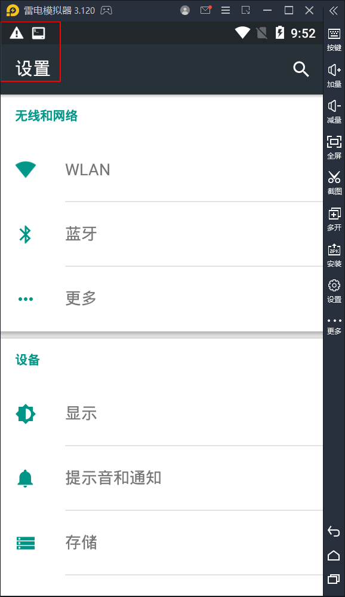

# Android_hook_sf_draw_x86
hook surfaceflinger进程的eglSwapBuffers方式实现绘制,适用雷电模拟器3.

该版本仅适用于x86版本.

# 使用方法
```
cd jni
ndk-build
```

```
cd libs/x86
adb push inject /data/local/tmp
adb push libhello.so /data/local/tmp
adb shell
cd /data/local/tmp
chmod 777 inject
./inject
```

参考了这篇文章

https://blog.csdn.net/jinzhuojun/article/details/9900105


